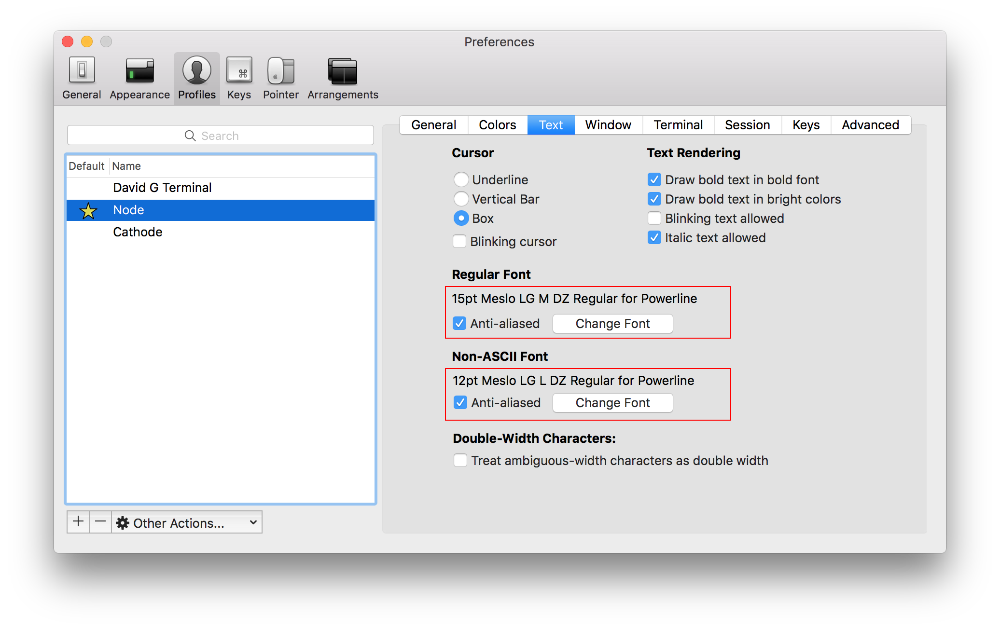

## Sesión 1 - Super poderes para Terminal MacOSX
En esta sesión preparamos un entorno con Mac OSX para trabajar con las siguientes herramientas:

#### Instala iTerm 2
[https://www.iterm2.com/](https://www.iterm2.com/)

iTerm 2 aporta mejoras a la aplicación que viene con MacOSX **Terminal**
Con funcionalidades como:
- Dividir paneles
- Autocompletado
- Temas
- Personalización del prompt

[Esquemas de Color para iTerm](https://github.com/mbadolato/iTerm2-Color-Schemes)

#### Mejora tu Shell con ZSH
Mediante [Oh my ZSH](https://github.com/robbyrussell/oh-my-zsh) podrás añadir a tu terminal funcionalidades que te permitirán ser más productivo:
- Directorios predictivos
- Shorcuts
- Autocompletados de directorios y Git
- Extensión del *path*
- Reemplazando el *path*

#### Agnoster Theme
Para cambiar el tema que trae por defecto `Oh my ZSH` edita el archivo `.zshrc` con el editor de texto de terminal **nano**
```terminal
nano ~/.zshrc
```

Una vez abierto, edita la variable `ZSH_THEME` y añade el tema que quieras. En mi caso tengo [Agnoster](https://gist.github.com/agnoster/3712874):
```terminal
ZSH_THEME="agnoster"
```

Recuerda que para que se visualicen correctamente los caracteres que indican los diferentes estados de Git necesitas decirle a **iTerm** que use una de las [Powerline Fonts](https://github.com/powerline/fonts). Yo tengo instalada la Menslo


