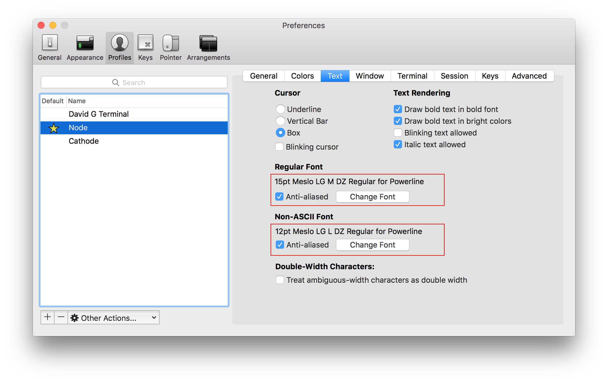

## Sesión 1 - Preparando el entorno
En esta sesión preparamos un entorno con Mac OSX para trabajar con las siguientes herramientas:

#### Instala iTerm 2
[https://www.iterm2.com/](https://www.iterm2.com/)

iTerm 2 aporta mejoras a la aplicación que viene con MacOSX **Terminal**
Con funcionalidades como:
- Dividir paneles
- Autocompletado
- Temas
- Personalización del prompt

[Esquemas de Color para iTerm](https://github.com/mbadolato/iTerm2-Color-Schemes)

#### Mejora tu Shell con ZSH
Mediante [Oh my ZSH](https://github.com/robbyrussell/oh-my-zsh) podrás añadir a tu terminal funcionalidades que te permitirán ser más productivo:
- Directorios predictivos
- Shorcuts
- Autocompletados de directorios y Git
- Extensión del *path*
- Reemplazando el *path*

#### Agnoster Theme
Para cambiar el tema que trae por defecto `Oh my ZSH` edita el archivo `.zshrc` con el editor de texto de terminal **nano**
```terminal
nano ~/.zshrc
```

Una vez abierto, edita la variable `ZSH_THEME` y añade el tema que quieras. En mi caso tengo [Agnoster](https://gist.github.com/agnoster/3712874):
```terminal
ZSH_THEME="agnoster"
```

Recuerda que para que se visualicen correctamente los caracteres que indican los diferentes estados de Git necesitas decirle a **iTerm** que use una de las [Powerline Fonts](https://github.com/powerline/fonts). Yo tengo instalada la Menslo



#### Personaliza tu Prompt (PS1)
ZSH ya trae de serie un prompt muy potente. Aunque también podemos añadir algo de [ASCII Art](http://1lineart.kulaone.com/home2) al inicio de cada línea de tu terminal:

```terminal
prompt_context() {
  local user=`whoami`

  if [[ "$user" != "$DEFAULT_USER" || -n "$SSH_CONNECTION" ]]; then
    prompt_segment $PRIMARY_FG default " %(!.%.) ¯\_(ツ)_/¯ "
  fi
}
```

#### Instala X-Code Tools
Si no tienes instalado `X-Code` y prefieren no tener que descargarte **4.7GB** instálate las **x-code tools** ejecutando en tu terminal:

```terminal
xcode-select --install
```

#### Instala Git
Git es una herramienta de control de versiones muy potente. Tienes un instalador disponible en la página oficial:
[Git](https://git-scm.com/)

#### Instala Node

Descarga en instalador de la versión LTE de NodeJS de la web oficial. Además, instalaremos Node Version Manager (NVM) para poder disponer de múltiples versiones de NodeJS instaladas de forma simultanea.

#### NodeJS vía NVM
Para instalar NVM abrimos la terminal y ejecutamos:
```
curl -o- https://raw.githubusercontent.com/creationix/nvm/v0.30.2/install.sh | bash
```

#### Trabajando con NVM

Actualmente la versión de NodeJS más estable es la 4.2. Para instalarla con NVM ejecuta:

````
nvm install v4.2
````

Si quieres ver todas las versiones de NodeJS que tienes instaladas:

````
nvm list
````

Para utilizar una versión específica:

````
nvm use v4.2
````

Para crear un alias:

````
nvm alias default 4
$ default -> 4 (-> v4.2)
```


Si necesitas más información sobre NVM visita [su página de GitHub](https://github.com/creationix/nvm).

---

### Actualizando NPM


NPM es el gestor de paquetes de NodeJS. Para actualizarlo:

```
$ sudo npm install npm -g
```

Comprueba la versión de npm:

```
$ npm --version
```

Actualmente la versión de NPM es la **3.6.0**


